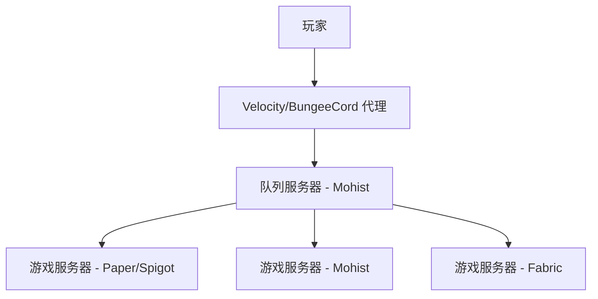
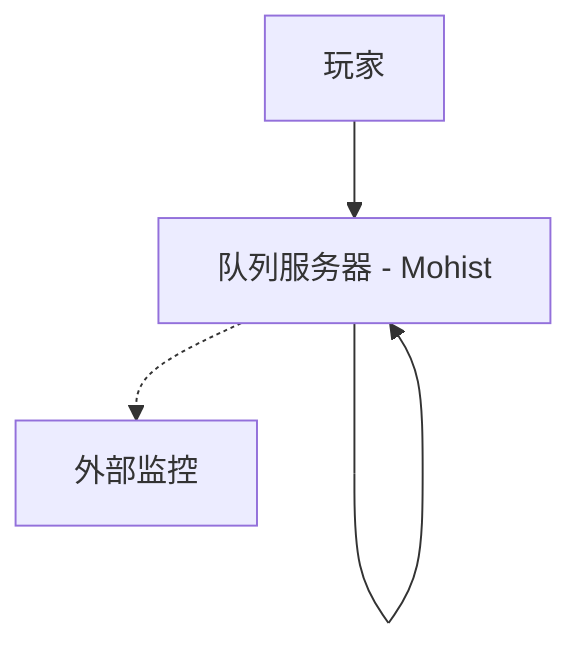

# Minecraft Queue Server - Mohist Edition

[](https://www.gnu.org/licenses/gpl-3.0)
[](https://www.oracle.com/java/technologies/javase-jdk17-downloads.html)
[](https://www.minecraft.net/)
[](https://mohistmc.com/)

一个专为 Minecraft 服务器设计的队列管理系统，特别针对 Mohist 混合服务器（支持 Forge Mod 和 Bukkit 插件）进行了优化。该系统支持服务器负载均衡、VIP 优先队列、以及非正版玩家支持。

## 🌟 核心特性

### 队列管理
- ✅ **智能队列系统** - 自动管理玩家排队，支持批量传送
- ✅ **VIP 优先队列** - VIP 玩家享有优先进入权限
- ✅ **实时监控** - 实时监控目标服务器状态和在线人数
- ✅ **自动重连** - 服务器离线时自动暂停队列，恢复时继续

### 服务器兼容性
- ✅ **Mohist 混合服务器** - 完全兼容 Forge Mod 和 Bukkit 插件环境
- ✅ **非正版支持** - 支持离线模式服务器和非正版玩家
- ✅ **多服务器架构** - 支持 BungeeCord/Velocity 代理网络
- ✅ **独立/代理模式** - 可作为独立服务器或代理网络的一部分运行

### 管理功能
- ✅ **命令系统** - 完整的管理员和玩家命令集
- ✅ **配置热重载** - 无需重启即可重新加载配置
- ✅ **数据持久化** - 支持 SQLite/MySQL 数据库存储
- ✅ **详细日志** - 完整的操作日志和错误追踪

## 📋 系统要求

- **Java**: 17 或更高版本
- **服务器**: Mohist 1.20.1 或兼容版本
- **内存**: 最低 2GB RAM 推荐
- **网络**: 稳定的网络连接（用于服务器间通信）

## 🚀 快速开始

### 1. 下载和安装

从 [Releases](releases/) 页面下载最新版本的插件 JAR 文件：

```bash
# 下载预编译版本
wget https://github.com/xiaoxiao-cvs/QueueServer/releases/latest/download/queue-mohist-1.0.0-SNAPSHOT.jar
```

或者从源码编译：

```bash
# 克隆仓库
git clone https://github.com/xiaoxiao-cvs/QueueServer.git
cd QueueServer

# 编译插件
mvn clean package

# 插件文件位于 target/queue-mohist-1.0.0-SNAPSHOT.jar
```

### 2. 部署插件

1. 将编译好的 JAR 文件放入 Mohist 服务器的 `plugins/` 目录
2. 启动服务器以生成默认配置文件
3. 根据需要修改配置文件 `plugins/MinecraftQueueServer/config.yml`
4. 重启服务器或使用 `/queueadmin reload` 重新加载配置

### 3. 基础配置

编辑 `config.yml` 文件：

```yaml
# 服务器设置
server:
  queue-server: true
  target-server-host: "your-game-server.com"  # 目标游戏服务器地址
  target-server-port: 25565                   # 目标游戏服务器端口
  max-players: 45                             # 队列服务器最大容量
  standalone-mode: false                      # 是否为独立模式

# 队列设置
queue:
  enabled: true
  check-interval: 30      # 检查间隔（秒）
  transfer-batch-size: 5  # 批量传送数量
```

## 📖 使用指南

### 玩家命令

| 命令 | 别名 | 描述 | 示例 |
|------|------|------|------|
| `/queue` | `/q` | 查看当前队列位置 | `/queue` |
| `/queueinfo` | `/qi`, `/qinfo` | 显示详细队列状态 | `/queueinfo` |
| `/leave` | `/lq` | 离开队列 | `/leave` |

### 管理员命令

| 命令 | 权限 | 描述 | 示例 |
|------|------|------|------|
| `/queueadmin reload` | `queue.admin` | 重新加载配置 | `/queueadmin reload` |
| `/queueadmin status` | `queue.admin` | 查看系统状态 | `/queueadmin status` |
| `/queueadmin kick <player>` | `queue.admin` | 将玩家踢出队列 | `/queueadmin kick Steve` |
| `/queueadmin priority <player>` | `queue.admin` | 给予玩家优先权 | `/queueadmin priority Steve` |

### 权限节点

- `queue.admin` - 管理员权限（所有管理命令）
- `queue.vip` - VIP 权限（优先队列）
- `queue.bypass` - 绕过队列直接进入

## ⚙️ 高级配置

### VIP 系统配置

```yaml
vip:
  enabled: true
  priority-slots: 10        # VIP 专用位置数量
  bypass-queue: true        # VIP 是否可以绕过队列
  priority-multiplier: 2.0  # VIP 优先级倍数
```

### 数据库配置

```yaml
database:
  type: "sqlite"  # 或 "mysql"
  # SQLite 配置
  sqlite:
    file: "queue_data.db"
  # MySQL 配置（可选）
  mysql:
    host: "localhost"
    port: 3306
    database: "queue_server"
    username: "your_username"
    password: "your_password"
```

### 服务器监控配置

```yaml
monitor:
  enabled: true
  check-interval: 30          # 监控检查间隔（秒）
  broadcast-interval: 300     # 状态广播间隔（秒）
  connection-timeout: 5000    # 连接超时时间（毫秒）
  broadcast-on-change: true   # 状态变化时立即广播
```

## 🔧 开发指南

### 项目结构

```
src/main/java/com/github/queueserver/mohist/
├── QueueMohistPlugin.java          # 主插件类
├── commands/                       # 命令处理器
│   ├── QueueCommands.java         # 玩家命令
│   └── AdminCommands.java         # 管理员命令
├── config/                        # 配置管理
│   └── ConfigManager.java         # 配置文件管理器
├── database/                      # 数据库层
│   └── SimpleDatabaseManager.java # 数据库管理器
├── queue/                         # 队列系统
│   └── SimpleQueueManager.java   # 队列管理器
├── vip/                          # VIP 系统
│   └── VIPManager.java           # VIP 管理器
├── monitor/                      # 服务器监控
│   └── ServerMonitor.java        # 服务器状态监控
├── listeners/                    # 事件监听器
│   ├── PlayerListener.java       # 玩家事件
│   └── ServerListener.java       # 服务器事件
└── compatibility/                # 兼容性处理
    └── ModCompatibilityHandler.java # Mod 兼容性
```

### 构建项目

```bash
# 安装依赖并编译
mvn clean install

# 仅编译打包
mvn clean package

# 跳过测试编译
mvn clean package -DskipTests
```

### 调试模式

在 `config.yml` 中启用调试模式：

```yaml
debug:
  enabled: true
  log-level: "DEBUG"
  verbose-queue: true
  monitor-details: true
```

## 🌐 网络架构

### 代理模式部署



### 独立模式部署



## 🔍 故障排除

### 常见问题

**Q: 插件无法连接到目标服务器**
- 检查目标服务器地址和端口配置
- 确认目标服务器正在运行且可访问
- 检查防火墙设置

**Q: VIP 系统不工作**
- 确认 VIP 权限节点 `queue.vip` 已正确分配
- 检查 VIP 配置是否启用
- 验证权限插件配置

**Q: 数据库连接失败**
- 检查数据库配置信息
- 确认数据库服务正在运行
- 验证数据库权限设置

### 日志分析

插件日志位于 `logs/latest.log`，搜索以下关键词：

- `[QueueServer]` - 插件主要日志
- `[Queue]` - 队列相关操作
- `[Monitor]` - 服务器监控日志
- `[VIP]` - VIP 系统日志
- `ERROR` - 错误信息

## 📊 性能优化

### 服务器优化建议

1. **JVM 参数优化**：
```bash
java -Xms2G -Xmx4G -XX:+UseG1GC -XX:+UnlockExperimentalVMOptions \
     -XX:MaxGCPauseMillis=100 -XX:+DisableExplicitGC \
     -jar mohist-server.jar
```

2. **配置优化**：
```yaml
queue:
  check-interval: 15        # 减少检查间隔提高响应速度
  transfer-batch-size: 3    # 较小的批次大小减少延迟

monitor:
  check-interval: 20        # 优化监控频率
  connection-timeout: 3000  # 减少超时时间
```

## 🤝 贡献指南

我们欢迎任何形式的贡献！

1. Fork 本仓库
2. 创建功能分支 (`git checkout -b feature/AmazingFeature`)
3. 提交更改 (`git commit -m 'Add some AmazingFeature'`)
4. 推送到分支 (`git push origin feature/AmazingFeature`)
5. 开启 Pull Request

### 代码规范

- 使用 Java 17+ 语法特性
- 遵循 Google Java Style Guide
- 添加适当的注释和文档
- 编写单元测试

## 📝 更新日志

### v1.0.0-SNAPSHOT (开发中)
- ✅ 基础队列管理系统
- ✅ Mohist 混合服务器支持
- ✅ VIP 优先队列
- ✅ 服务器状态监控
- ✅ 数据库持久化
- ✅ 命令系统
- 🔄 代理网络集成
- 🔄 Web 管理界面

## 📄 许可证

本项目基于 [MIT License](LICENSE) 开源协议。

## 🔗 相关链接

- [Mohist 官网](https://mohistmc.com/)
- [Spigot API 文档](https://hub.spigotmc.org/javadocs/spigot/)
- [Velocity 文档](https://docs.papermc.io/velocity)
- [问题反馈](https://github.com/xiaoxiao-cvs/QueueServer/issues)

## 👥 开发团队

- **维护者**: QueueServer Team
- **贡献者**: 查看 [Contributors](https://github.com/xiaoxiao-cvs/QueueServer/graphs/contributors)

---

如果这个项目对您有帮助，请给我们一个 ⭐ Star！

有问题或建议？欢迎 [提交 Issue](https://github.com/xiaoxiao-cvs/QueueServer/issues/new) 或加入我们的社区讨论。